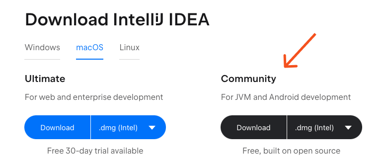

# Setup

Nous allons voir ici :

- Comment se setup simplement pour commencer à développer ?

## Comment se setup simplement pour commencer à développer ?

Sans renter dans les guerres sur les meilleurs IDE, utiliser IntelliJ permet de se setup extrêmement simplement, avec le
bénéfice d'avoir en plus un des meilleurs outils de développement pour le Java.

### Télécharger IntelliJ Community

C'est la version gratuite du célèbre IDE IntelliJ. Malgré cela, ne vous y trompez pas, elle est largement suffisante
pour la plupart des projets, même professionnels !

Vous pouvez la trouver très simplement sur internet, ou simplement suivre ce lien :
https://www.jetbrains.com/idea/download/

Vous pouvez ensuite l'installer en suivant les indications.

### Créer un nouveau projet

- Lancer IntelliJ
- Sélectionner New Project.
- Choisir créer un Empty Project
- Si vous n'avez pas de JDK, vous pouvez simplement en télécharger un depuis la liste déroulante
- Appuyer sur create

### Présentation rapide de l'interface

- Vue des fichiers
- Éditeur de code
- Console
- Bouton pour lancer son programme

### Implementer votre "Hello, World"

- Créer une nouvelle classe
- Ajouter une méthode main pour exécuter le programme
- Ajouter une instruction pour écrire un message dans la console
- Lancer le programme

